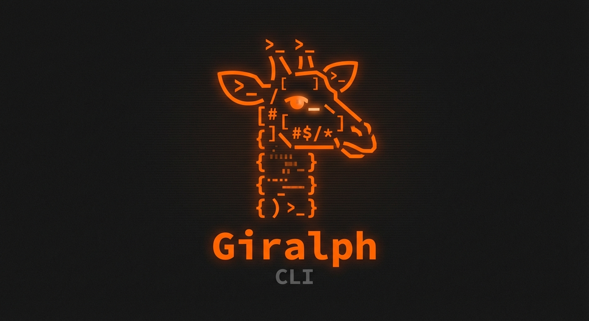

<p align="center">
  
</p>

# giralph

Open source ralph loop — autonomous multi-agent orchestrator with debate and Telegram support.

Inspired by [Ralph](https://ghuntley.com/ralph/) and [Cook](https://rjcorwin.github.io/cook/).

## Install & run

```bash
# Run directly without installing (requires uv)
uvx giralph init
uvx giralph run

# Or install globally
uv tool install giralph
giralph init
giralph run

# Or install from git
uvx --from git+https://github.com/user/giralph giralph run
```

## Quick start

```bash
cd your-project/

# Scaffold giralph files
giralph init

# Edit PROMPT.md with your task
echo "Fix the login bug in auth.py" > PROMPT.md

# Start the loop
giralph run

# With options
giralph run -a codex                      # use a different agent
giralph run -d claude-code,codex          # debate mode
giralph run -n 10 -c 30                   # 10 iterations, 30s cooldown
```

## Commands

| Command | Description |
|---------|-------------|
| `giralph init` | Scaffold INSTRUCTION.md, config.json, MEMORY.md, PLAN.md, PROMPT.md |
| `giralph run` | Start the ralph loop |
| `giralph status` | Show current state of giralph files |

## Files (created by `init`)

| File | Purpose |
|------|---------|
| `INSTRUCTION.md` | System prompt for the management agent |
| `MEMORY.md` | Persistent memory, reloaded each iteration |
| `PLAN.md` | Current plan and progress |
| `PROMPT.md` | Current task |
| `HISTORY.md` | Auto-generated log of all iterations |
| `config.json` | Agent selection, cooldown, debate config |

## Config

```json
{
    "agent": "claude-code",
    "max_iterations": 0,
    "cooldown_seconds": 5,
    "debate_agents": ["claude-code", "codex"],
    "debate_judge": "claude-code"
}
```

## Supported agents

- **claude-code** — runs with `--channels` for Telegram support
- **codex** — OpenAI Codex CLI
- **gemini-cli** — Google Gemini CLI (pipe mode)
- **qwen-code** — Qwen Code CLI
- **opencode** — OpenCode CLI

## How it works

Each iteration:
1. Reload INSTRUCTION.md + MEMORY.md + PLAN.md + PROMPT.md
2. Build combined prompt with `<memory>`, `<plan>`, `<task>` blocks
3. Run agent (or debate: run multiple agents, then judge picks best)
4. Parse `GIRALPH_STATUS` block from output
5. Apply circuit breakers (exit on completion, repeated errors, no work, blocked)
6. Log to HISTORY.md, cooldown, repeat

## Circuit breakers

The loop automatically stops when:
- Agent reports `exit: YES` (task complete, no work, etc.)
- Same error occurs 3 iterations in a row
- No output for 3 consecutive iterations
- `NO_WORK` reported 2 times
- Max iterations reached

## Telegram

Uses Claude Code's built-in `--channels` flag. Configure your Telegram bot via `/telegram:configure` in Claude Code, then `giralph run` handles bidirectional messaging automatically.
